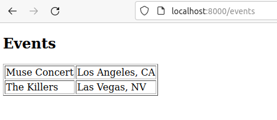

# Tagg

[](https://hex.pm/packages/tagg)
[](https://hexdocs.pm/tagg/)

Tagg is an HTML templating engine written in [Gleam](https://gleam.run/) that
uses XML/HTML tag syntax to render HTML.

**Note**: This library is still being written!

## Example

### router.gleam

```gleam
fn events_page(req: Request, web_context: Context) -> Response {
  // The home page can only be accessed via GET requests, so this middleware is
  // used to return a 405: Method Not Allowed response for all other methods.
  use <- wisp.require_method(req, Get)

  let context =
    cx.dict()
    |> cx.add_list("events", [
      cx.dict()
        |> cx.add_string("name", "Muse Concert")
        |> cx.add_string("location", "Los Angeles, CA"),
      cx.dict()
        |> cx.add_string("name", "The Killers")
        |> cx.add_string("location", "Las Vegas, NV"),
    ])

  case tagg.render(web_context.tagg, "events.html", context) {
    Ok(html) -> {
      wisp.ok()
      |> wisp.html_body(string_builder.from_string(html))
    }
    Error(err) -> {
      io.debug(err)
      wisp.internal_server_error()
    }
  }
}
```

### page.html

```html
<!doctype html>
<html lang="en-US">
  <head>
    <meta charset="utf-8" />
    <meta name="viewport" content="width=device-width" />
    <title>Customers</title>
  </head>
  <body>
    <component path="/events.html"/>
  </body>
</html>
```

### events.html

```html
<h2>Events</h2>
<for items="events" item="event" index="i">
  <div>@event.name</div>
  <div>@event.location</div>
</for>
```

### Output




## Installing

```sh
gleam add tagg
```

## Development

```sh
gleam run   # Run the project
gleam test  # Run the tests
gleam shell # Run an Erlang shell
```
